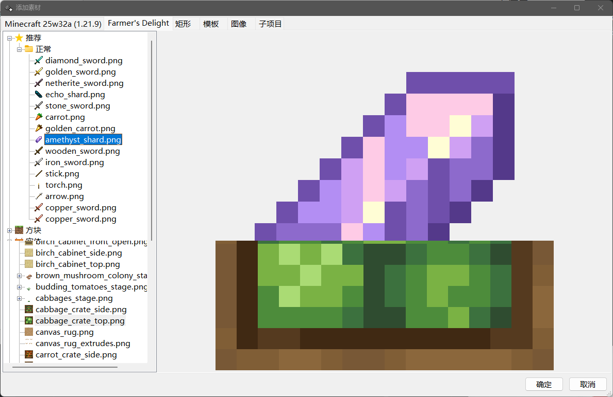
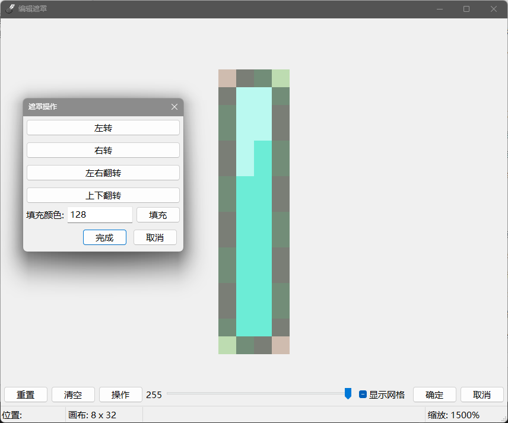
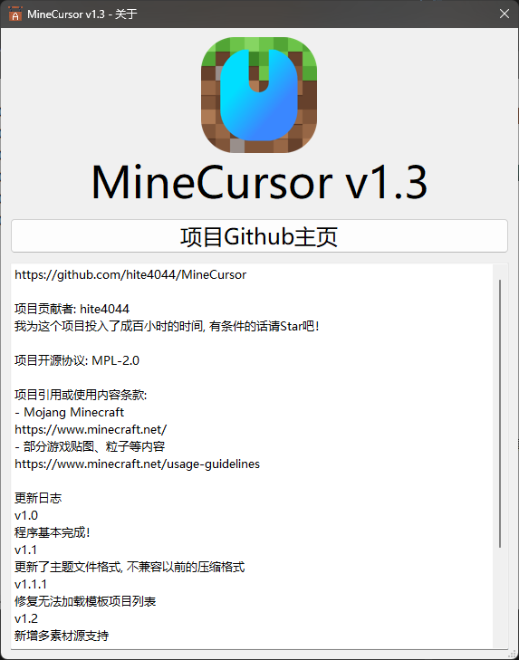

# _MineCursor_

### MC主题鼠标指针编辑器

---

## 😔贡献

### 欢迎任何贡献！

这是一个独立学生开发者的无奈与期待

这个项目用了我6个月去发布第一个版本

[编程指引](program.md)

## 💪特色

1. 界面简洁
2. 一键应用
3. 便捷分享

## 💥如何运行项目

### [下载最新构建版本](https://github.com/hite4044/MineCursor/releases/latest)

解压后双击`MineCursor.exe`即可运行

### 从源代码运行

1. 下载 [Python 3.10.9](https://www.python.org/ftp/python/3.10.9/python-3.10.9-amd64.exe) 安装程序
2. 在安装程序的首个页面勾选 `Add Python 3.10 to PATH` 然后 `Install Now`, 安装完成后关闭窗口
3. 从项目Github页面下载项目Zip压缩包 (Code绿色按钮->Download ZIP)
4. 解压至某个地方, 打开该文件夹, 并在地址栏输入`cmd`并回车
5. 在命令提示符窗口里运行命令 `python -m pip install -r requirements.txt`
6. 运行命令 `python main.py`
7. 完成！工具启动！

### TIP: 如果想要更加方便地打开工具, 可以建立一个快捷方式:

1. 在工具的主题列表右键-选择设置
2. 点击创建桌面快捷方式

## 🔒项目权限

此项目:

- [MPL2.0 许可证](https://www.mozilla.org/en-US/MPL/2.0/)

附带主题 (由[hite404](https://github.com/hite4044)与[YOU MING 柚明](https://github.com/YOU-MING-6)共同制作):

- [CC BY-NC-SA 4.0](https://creativecommons.org/licenses/by-nc-sa/4.0/)

项目引用或使用内容:

- 项目图标:
-
    - [Mojang Minecraft](https://www.minecraft.net/)
-
    - 感谢 [YOU-MING-柚明@bilibili](https://space.bilibili.com/1337092956) 制作了项目图标
- 项目自带资源库:
-
    - 部分游戏贴图 (遵循[此条款](https://www.minecraft.net/usage-guidelines))

## 🐍Python版本

Python 3.10.9

## ✨功能

| 功能           | 实现状态 | 描述               |
|--------------|------|------------------|
| 收藏源信息        | ⏳    |                  |
| 主页面禁用拖拽主题    | ⏳    |                  |
| 快捷源信息替换      | ⏳    |                  |
| 附带自动卸载脚本     | ⏳    |                  |
| 素材附魔支持       | ⏳    |                  |
| 支持动图导入       | ⏳    |                  |
| 系统高缩放测试      | ✅    |                  |
| 拖动导出主题       | ✅    |                  |
| 双击主题文件打开适配   | ✅    | 双击打开主题文件时会提示导入主题 |
| 选择元素跳转至对应帧数  | ✅    |                  |
| 素材源随主题发布     | ✅    |                  |
| 测试Zip源导入     | ✅    |                  |
| 首次启动时导入默认主题包 | ✅    |                  |
| 对Jar资源的支持    | ✅    | 存放在默认Data目录下     |

## 🎨画廊

### 主界面

### 项目编辑器

### 新增元素

### 遮罩编辑器

### 关于

