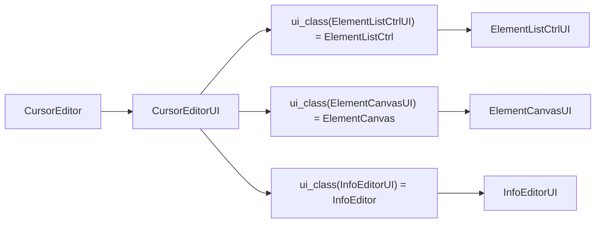
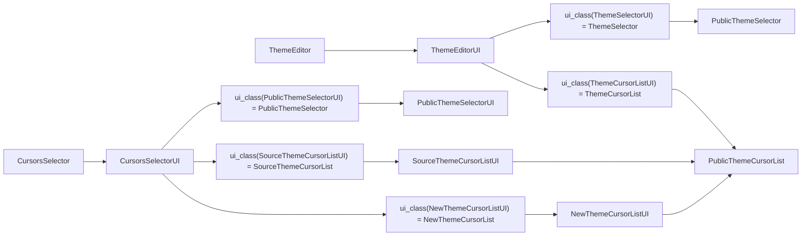

# MineCursor项目编程指引

## 项目结构

+ [assets](assets)
    + [default_themes](assets/default_themes) 内置的指针主题
    + [icons](assets/icons) 对话框、菜单图标
    + [sources](assets/sources) 默认素材源
    + [file_type_add.reg](assets/file_type_add.reg) 注册指针主题文件类型
    + [file_type_remove.reg](assets/file_type_remove.reg) 移除指针主题文件类型
    + [icon.ico](assets/icon.ico) MineCursor图标 - ICO位图
    + [icon.kra](assets/icon.kra) MineCursor图标 - Krita文档
    + [icon.png](assets/icon.png) MineCursor图标 - PNG位图
    + [NULL.png](assets/NULL.png) 一个简单的NULL字样的图像
+ [lib](lib)
    + [cursor](lib/cursor)
        + [inst_ini_gen.py](lib/cursor/inst_ini_gen.py) 鼠标主题自动安装脚本生成器
        + [setter.py](lib/cursor/setter.py) 定义鼠标类型枚举、用于设置系统指针
        + [writer.py](lib/cursor/writer.py) 用于写入指针文件(.cur/.ani)
    + [datas](lib/datas)
        + [base_struct.py](lib/datas/base_struct.py) 定义公用数据结构
        + [data_dir.py](lib/datas/data_dir.py) 管理数据存储文件夹的创建
        + [project.py](lib/datas/project.py) 定义数据结构 - 指针项目及其元素
        + [source.py](lib/datas/source.py) 定义素材源指示结构、管理素材源
        + [theme.py](lib/datas/theme.py) 定义数据结构 - 指针项目及其元素
    + [tools](lib/tools)
        + [gen_theme_preview.py](lib/tools/gen_theme_preview.py) 快速生成主题的动态透明预览视频
        + [replace_source.py](lib/tools/replace_source.py) 快速迁移旧的素材源到新的素材源
    + [clipboard.py](lib/clipboard.py) 定义剪切板
    + [config.py](lib/config.py) 管理工具的配置及其文件
    + [data.py](lib/data.py) 导向[datas](lib/datas)文件夹里的各个脚本定义的结构
    + [dpi.py](lib/dpi.py) 提供系统缩放检测与分辨率换算
    + [image_pil2wx.py](lib/image_pil2wx.py) 提供从`PIL.Image.Image`转化到`wx.Image`的函数
    + [info.py](lib/info.py) 定义项目信息（版本、更新日志）
    + [log.py](lib/log.py) 日志库
    + [perf.py](lib/perf.py) 提供性能分析类
    + [render.py](lib/render.py) 负责渲染鼠标指针项目
    + [resources.py](lib/resources.py) 主题管理器+带素材源的主题包的导入支持
    + [source_cvt.py](lib/source_cvt.py) 从(zip/jar/文件夹)转成统一的素材源格式
    + [t_struct.py](lib/t_struct.py) 重定向至[datas/base_struct.py](lib/datas/base_struct.py)
    + [ui_interface.py](lib/ui_interface.py) 提供UI类与功能类的初始化重定向
+ [readme_assets](readme_assets) README.md里用到的资源
+ [ui](ui) 各个组件的UI类
    + [cursor_editor.py](ui/cursor_editor.py) 项目编辑器
    + [element_add_dialog.py](ui/element_add_dialog.py) 元素添加对话框
    + [public_list_ctrl.py](ui/public_list_ctl.py) 公用列表框(主题选择器\项目列表)
    + [select.py](ui/select.py) 提供一个选择所有的列表项的函数
    + [theme_creator.py](ui/theme_creator.py) 主题合成器
    + [theme_editor.py](ui/theme_editor.py) 主窗口
+ [ui_ctl](ui_ctl) 各个组件的逻辑类 (简单的组件会混合UI与逻辑)
    + [cursor_editor_widgets](ui_ctl/cursor_editor_widgets) 项目编辑器的各个组件&窗口
        + [element_canvas.py](ui_ctl/cursor_editor_widgets/element_canvas.py) 预览窗口
        + [element_list_ctrl.py](ui_ctl/cursor_editor_widgets/element_list_ctrl.py) 元素列表
        + [events.py](ui_ctl/cursor_editor_widgets/events.py) 自定义事件
        + [info_editor.py](ui_ctl/cursor_editor_widgets/info_editor.py) 项目\元素信息编辑器
        + [mask_editor.py](ui_ctl/cursor_editor_widgets/mask_editor.py) 遮罩编辑器
        + [rate_editor.py](ui_ctl/cursor_editor_widgets/rate_editor.py) 帧率编辑器
        + [source_info_editor.py](ui_ctl/cursor_editor_widgets/source_info_editor.py) 源信息编辑器
        + [step_editor.py](ui_ctl/cursor_editor_widgets/step_editor.py) 渲染步骤编辑器
    + [element_sources](ui_ctl) 各种元素类型的新建页面
        + [asset_source.py](ui_ctl/element_sources/asset_source.py) MC贴图
        + [image_source.py](ui_ctl/element_sources/image_source.py) 位图
        + [project_source.py](ui_ctl/element_sources/project_source.py) 子项目
        + [rect.py](ui_ctl/element_sources/rect_source.py) 矩形
        + [source_assets_manager.py](ui_ctl/element_sources/source_assets_manager.py) 负责加载MC素材源的树状结构
        + [temp_source.py](ui_ctl/element_sources/temp_source.py) 模板(子项目)
    + [about_dialog.py](ui_ctl/about_dialog.py) 关于对话框
    + [cursor_editor.py](ui_ctl/cursor_editor.py) 项目编辑器
    + [element_add_dialog.py](ui_ctl/element_add_dialog.py) 元素添加对话框
    + [public_list_ctrl.py](ui_ctl/public_list_ctl.py) 公用列表框的逻辑(主题选择器\项目列表)
    + [settings.py](ui_ctl/settings.py) MineCursor的设置
    + [source_editor.py](ui_ctl/sources_editor.py) 管理素材源
    + [theme_creator.py](ui_ctl/theme_creator.py) 主题合成器
    + [theme_editor.py](ui_ctl/theme_editor.py) 主窗口
+ [widget](widget)
    + [adv_progress_dialog.py](widget/adv_progress_dialog.py) 高级双行进度对话框
    + [center_text.py](widget/center_text.py) 居中文本
    + [data_dialog.py](widget/data_dialog.py) 数据对话框
    + [data_entry.py](widget/data_entry.py) 数据输入框
    + [ect_menu.py](widget/ect_menu.py) 快速创建与绑定的菜单(绑定像过ETC一样快)
    + [editable_listctrl.py](widget/editable_listctrl.py) 可编辑的列表框
    + [font.py](widget/font.py) 管理缓存与生成不同字号的字体
    + [label_entry.py](widget/label_entry.py) 带有前缀文本提示的对话框
    + [no_tab_notebook.py](widget/no_tab_notebook.py) 没有标签的翻页控件
    + [widget_pad.py](widget/widget_pad.py) 无需`wx.Sizer`的控件放置
    + [win_icon.py](widget/win_icon.py) 为窗口设置各种大小的图标
+ [main.py] 程序入口

## 图形化界面编写指南

本项目采用了控件布局与控件逻辑分离的方式
一个控件的功能类会继承这个控件的逻辑类

这是普通UI组件的初始化顺序
> ui_class函数()会寻找所有调用栈中与传入类重名但没有UI后缀的类, 并返回该类
>
> 实际上是为了UI类在被非UI类初始化时可以把UI类中的UI类替换为对应的非UI类（有点绕

而`theme_editor.py`与`theme_creator.py`有些不同，它们共用几个列表组件

