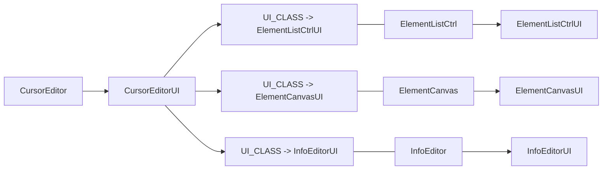
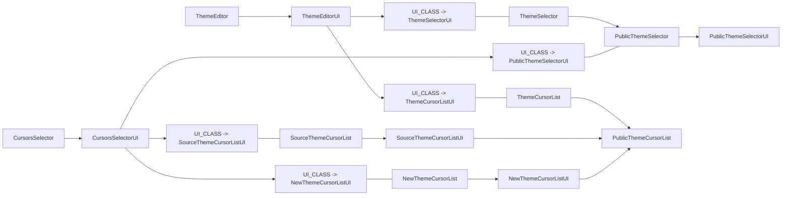

这边说明一下UI初始化框架

这是普通UI组件的依赖顺序
> ui_class函数会寻找所有调用栈中与传入类重名但没有UI后缀的类, 并返回该类
> 实际上是为了UI类在被非UI类初始化时可以吧UI类中的UI类替换为对应的非UI类（有点绕

```mermaid
graph LR
    CursorEditor --> CursorEditorUI
    CursorEditorUI --> ui_ElementListCtrlUI[UI_CLASS -> ElementListCtrlUI] --- ElementListCtrl --> ElementListCtrlUI
    CursorEditorUI --> ui_ElementCanvasUI[UI_CLASS -> ElementCanvasUI] --- ElementCanvas --> ElementCanvasUI
    CursorEditorUI --> ui_InfoEditorUI[UI_CLASS -> InfoEditorUI] --- InfoEditor --> InfoEditorUI

```

而`theme_editor.py`与`theme_creator.py`有些不同，它们共用几个列表组件

```mermaid
graph LR
    ThemeEditor --> ThemeEditorUI
    ThemeEditorUI --> ThemeSelectorUI[UI_CLASS -> ThemeSelectorUI] --- ThemeSelector --> PublicThemeSelector
    ThemeEditorUI --> ThemeCursorListUI[UI_CLASS -> ThemeCursorListUI] --- ThemeCursorList --> PublicThemeCursorList
    CursorsSelector --> CursorsSelectorUI
    CursorsSelectorUI --> ui_PublicThemeSelectorUI[UI_CLASS -> PublicThemeSelectorUI] --- PublicThemeSelector --> PublicThemeSelectorUI
    CursorsSelectorUI --> ui_SourceThemeCursorListUI[UI_CLASS -> SourceThemeCursorListUI] --- SourceThemeCursorList --> SourceThemeCursorListUI ---> PublicThemeCursorList
    CursorsSelectorUI --> ui_NewThemeCursorListUI[UI_CLASS -> NewThemeCursorListUI] --- NewThemeCursorList --> NewThemeCursorListUI --> PublicThemeCursorList
```
